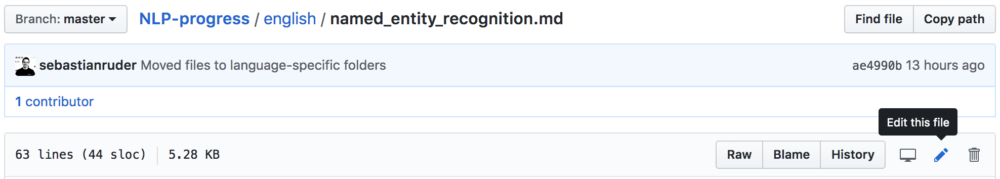
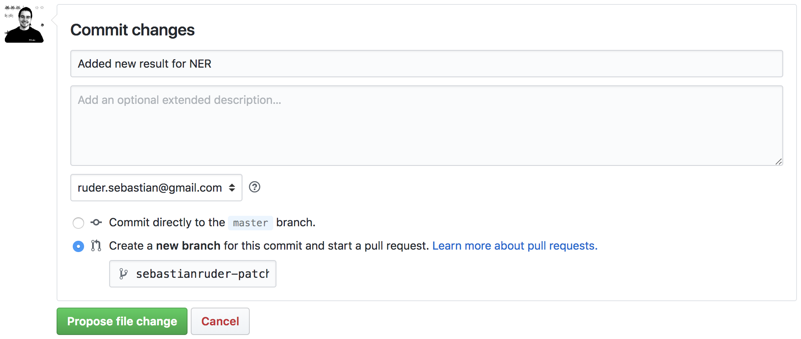

# Tracking Progress in Natural Language Processing

## Table of contents

### English

- [Automatic speech recognition](english/automatic_speech_recognition.md)
- [CCG](english/ccg.md)
- [Common sense](english/common_sense.md)
- [Constituency parsing](english/constituency_parsing.md)
- [Coreference resolution](english/coreference_resolution.md)
- [Dependency parsing](english/dependency_parsing.md)
- [Dialogue](english/dialogue.md)
- [Domain adaptation](english/domain_adaptation.md)
- [Entity linking](english/entity_linking.md)
- [Grammatical error correction](english/grammatical_error_correction.md)
- [Information extraction](english/information_extraction.md)
- [Intent Detection and Slot Filling](english/intent_detection_slot_filling.md)
- [Language modeling](english/language_modeling.md)
- [Lexical normalization](english/lexical_normalization.md)
- [Machine translation](english/machine_translation.md)
- [Missing elements](english/missing_elements.md)
- [Multi-task learning](english/multi-task_learning.md)
- [Multi-modal](english/multimodal.md)
- [Named entity recognition](english/named_entity_recognition.md)
- [Natural language inference](english/natural_language_inference.md)
- [Part-of-speech tagging](english/part-of-speech_tagging.md)
- [Question answering](english/question_answering.md)
- [Relation prediction](english/relation_prediction.md)
- [Relationship extraction](english/relationship_extraction.md)
- [Semantic textual similarity](english/semantic_textual_similarity.md)
- [Semantic parsing](english/semantic_parsing.md)
- [Semantic role labeling](english/semantic_role_labeling.md)
- [Sentiment analysis](english/sentiment_analysis.md)
- [Shallow syntax](english/shallow_syntax.md)
- [Simplification](english/simplification.md)
- [Stance detection](english/stance_detection.md)
- [Summarization](english/summarization.md)
- [Taxonomy learning](english/taxonomy_learning.md)
- [Temporal processing](english/temporal_processing.md)
- [Text classification](english/text_classification.md)
- [Word sense disambiguation](english/word_sense_disambiguation.md)

### Vietnamese

- [Dependency parsing](vietnamese/vietnamese.md#dependency-parsing)
- [Machine translation](vietnamese/vietnamese.md#machine-translation)
- [Named entity recognition](vietnamese/vietnamese.md#named-entity-recognition)
- [Part-of-speech tagging](vietnamese/vietnamese.md#part-of-speech-tagging)
- [Word segmentation](vietnamese/vietnamese.md#word-segmentation)

### Hindi

- [Chunking](hindi/hindi.md#chunking)
- [Part-of-speech tagging](hindi/hindi.md#part-of-speech-tagging)
- [Machine Translation](hindi/hindi.md#machine-translation)

### Chinese

- [Entity linking](chinese/chinese.md#entity-linking)
- [Chinese word segmentation](chinese/chinese_word_segmentation.md)
- [Question answering](chinese/question_answering.md)

### French

- [Question answering](french/question_answering.md)

### Russian

- [Question answering](russian/question_answering.md)

### Spanish

- [Entity linking](spanish/entity_linking.md#entity-linking)

### Portuguese

- [Question Answering](portuguese/question_answering.md)

### Korean

- [Question Answering](korean/question_answering.md)

### Nepali

- [Machine Translation](nepali/nepali.md#machine-translation)

This document aims to track the progress in Natural Language Processing (NLP) and give an overview
of the state-of-the-art (SOTA) across the most common NLP tasks and their corresponding datasets.

It aims to cover both traditional and core NLP tasks such as dependency parsing and part-of-speech tagging
as well as more recent ones such as reading comprehension and natural language inference. The main objective
is to provide the reader with a quick overview of benchmark datasets and the state-of-the-art for their
task of interest, which serves as a stepping stone for further research. To this end, if there is a 
place where results for a task are already published and regularly maintained, such as a public leaderboard,
the reader will be pointed there.

If you want to find this document again in the future, just go to [`nlpprogress.com`](https://nlpprogress.com/)
or [`nlpsota.com`](http://nlpsota.com/) in your browser.

### Contributing

#### Guidelines

**Results** &nbsp; Results reported in published papers are preferred; an exception may be made for influential preprints.

**Datasets** &nbsp; Datasets should have been used for evaluation in at least one published paper besides 
the one that introduced the dataset.

**Code** &nbsp; We recommend to add a link to an implementation 
if available. You can add a `Code` column (see below) to the table if it does not exist.
In the `Code` column, indicate an official implementation with [Official](http://link_to_implementation).
If an unofficial implementation is available, use [Link](http://link_to_implementation) (see below).
If no implementation is available, you can leave the cell empty.

#### Adding a new result

If you would like to add a new result, you can just click on the small edit button in the top-right
corner of the file for the respective task (see below).

This allows you to edit the file in Markdown. Simply add a row to the corresponding table in the
same format. Make sure that the table stays sorted (with the best result on top). 
After you've made your change, make sure that the table still looks ok by clicking on the
"Preview changes" tab at the top of the page. If everything looks good, go to the bottom of the page,
where you see the below form. 

Add a name for your proposed change, an optional description, indicate that you would like to
"Create a new branch for this commit and start a pull request", and click on "Propose file change".

#### Adding a new dataset or task

For adding a new dataset or task, you can also follow the steps above. Alternatively, you can fork the repository.
In both cases, follow the steps below:

1. If your task is completely new, create a new file and link to it in the table of contents above.
2. If not, add your task or dataset to the respective section of the corresponding file (in alphabetical order).
3. Briefly describe the dataset/task and include relevant references. 
4. Describe the evaluation setting and evaluation metric.
5. Show how an annotated example of the dataset/task looks like.
6. Add a download link if available.
7. Copy the below table and fill in at least two results (including the state-of-the-art)
  for your dataset/task (change Score to the metric of your dataset). If your dataset/task
  has multiple metrics, add them to the right of `Score`.
1. Submit your change as a pull request.
  
| Model           | Score  |  Paper / Source | Code |
| ------------- | :-----:| --- | --- |
|  |  |  | |

### Wish list

These are tasks and datasets that are still missing:

- Bilingual dictionary induction
- Discourse parsing
- Keyphrase extraction
- Knowledge base population (KBP)
- More dialogue tasks
- Semi-supervised learning
- Frame-semantic parsing (FrameNet full-sentence analysis)

### Exporting into a structured format

You can extract all the data into a structured, machine-readable JSON format with parsed tasks, descriptions and SOTA tables. 

The instructions are in [structured/README.md](structured/README.md).

### Instructions for building the site locally

Instructions for building the website locally using Jekyll can be found [here](jekyll_instructions.md).

